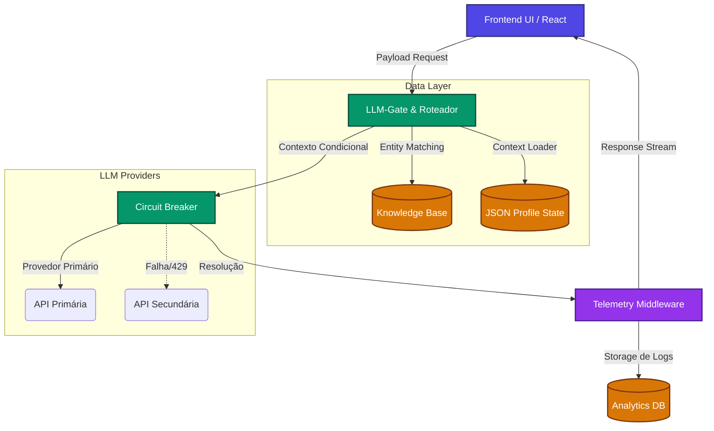

# ONE Architecture

**Sistema de Inteligência Artificial para Avaliação e Consultoria Psicológica**

Este repositório documenta a arquitetura de software e os padrões de Inteligência Artificial implementados no **ONE**. O sistema foi projetado para conduzir avaliações tipológicas avançadas, gerar dossiês automatizados e operar como um assistente de consultoria especialista.

O objetivo desta documentação é detalhar o **System Design**, as decisões arquiteturais frente aos desafios de IA Generativa e a orquestração técnica de Large Language Models (LLMs), demonstrando aderência aos padrões de mercado para Engenharia de IA.

## Princípio Arquitetural
Sistemas baseados em LLMs exigem infraestrutura resiliente para mitigar instabilidades de provedores e inconsistências de contexto. No ONE, a prioridade arquitetural foi estabelecer uma infraestrutura de suporte robusta (Observabilidade, Fallback, Segurança) anterior à implementação das lógicas analíticas complexas, garantindo previsibilidade e auditoria.

## Índice de Documentação

- [01. RAG Determinístico (Tool-Calling Paradigm)](./docs/01_RAG_Deterministico.md) - Abordagem estruturada de injeção de contexto via roteamento autônomo (LLM-Gate), otimizada para domínios clínicos restritos.
- [02. Resiliência e Motor de Fallback (Circuit Breaker)](./docs/02_Sistema_Fallback.md) - Camada HTTP agnóstica que protege a aplicação contra instabilidades de APIs (Rate Limits/Timeouts), executando chaveamento automático de provedores.
- [03. Observabilidade e LLMOps (AI Analytics)](./docs/03_Telemetria_e_Custos.md) - Monitoramento nativo para auditoria de consumo de tokens, rastreamento de latência e debug visual de contexto RAG.
- [04. Auditoria Cognitiva e Transparência (Explainable AI)](./docs/05_Auditoria_Cognitiva.md) - Espelhamento da injeção de contexto na interface gráfica, garantindo a verificabilidade da resposta gerada.
- [05. Orquestração Dinâmica de Prompt e Macro-RAG](./docs/06_Prompt_Orchestration.md) - Aplicação de *Dynamic Persona Swapping* (Skills modulares) e *Context Hydration* baseada no banco relacional.
- [06. Governança de Dados e Desacoplamento (BFF)](./docs/07_Seguranca_e_Arquitetura_BFF.md) - Conformidade com LGPD através de banco de dados estritamente local (Zero-Trust) e arquitetura Backend-For-Frontend (BFF).
- [07. Multi-Hop RAG e Integração Local (Offline-Ready)](./docs/08_Multi_Hop_RAG_e_Offline_LLMs.md) - Raciocínio sobre múltiplos documentos e suporte nativo a LLMs Open-Source executados localmente.
- [08. Trade-offs e Decisões de Engenharia](./docs/04_TradeOffs_Arquitetura.md) - Análise das decisões técnicas: Desktop vs Cloud, File System vs Bancos Relacionais, e priorização de infraestrutura.

## Diagrama de Arquitetura

