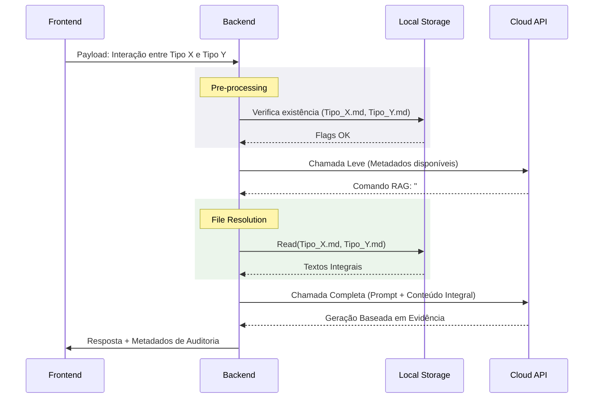

# RAG Determinístico e Arquitetura Multi-Pass (LLM-Gate)

Em sistemas corporativos que requerem a injeção de contexto profundo (ex: análises clínicas ou psicológicas), o uso convencional de Bancos de Dados Vetoriais (Vector Databases) apresenta vulnerabilidades ligadas à descontextualização (Chunking).

## Problema do RAG Convencional
Bancos vetoriais segmentam documentos e retornam blocos textuais isolados baseados em proximidade semântica. Se um operador solicita o cruzamento de duas patologias ou tipologias diferentes, o retorno vetorial tende a mesclar fragmentos de ambas de forma desordenada. Para o domínio analítico, fragmentar a literatura compromete a integridade do modelo teórico, resultando em respostas conceitualmente falhas (alucinação estrutural).

Injetar todo o escopo documental em cada requisição também se prova ineficiente devido ao alto custo operacional (Token Consumption) e à diluição de precisão (Lost in the middle).

## Solução: RAG Determinístico (Tool-Calling Paradigm)
A arquitetura ONE soluciona esse gargalo através de um sistema de extração determinística de entidades (Entity Extraction via Regex) pareada com delegação autônoma.

### 1. Extração Local (Pre-Processing)
Ao receber um input, o backend identifica entidades chaves (ex: `ESTP`, `1w2`) e confere em tempo real a existência de documentação complementar no File System. O *System Prompt* é então enriquecido com os metadados dos arquivos disponíveis, instruindo o LLM a requisitá-los apenas se essencial para a avaliação via comando protocolar (ex: `###BUSCAR:caminho###`).

### 2. Roteamento Dinâmico (LLM-Gate)
A requisição preliminar atua como um roteador de intenção. O modelo avalia a profundidade necessária. Se as informações contextuais correntes são suficientes, a resposta segue fluxo normal. Caso seja necessário acessar literatura bruta, o modelo retorna o *hook* e a execução é pausada na camada lógica.

### 3. Injeção de Contexto Integral
O backend resolve a requisição de busca carregando os arquivos especificados na íntegra (garantindo que o modelo consuma todos os espectros e nuances da tipologia). O payload completo alimenta uma segunda requisição, responsável por gerar o texto de entrega hiper-contextualizado.

## Flowchart de Execução

## Benefícios Avaliados
- **Consistência Clínica:** Redução material do risco de fusão de conceitos distintos. O LLM consome a documentação original validada antes de formular hipóteses.
- **Eficiência Operacional:** Otimização severa do gasto de tokens ao injetar apenas documentação referenciada, sob demanda.
- **Rastreabilidade (Observability):** O registro visual das ações do LLM fortalece a confiabilidade dos dados processados, facilitando a validação técnica pelos usuários e desenvolvedores.
