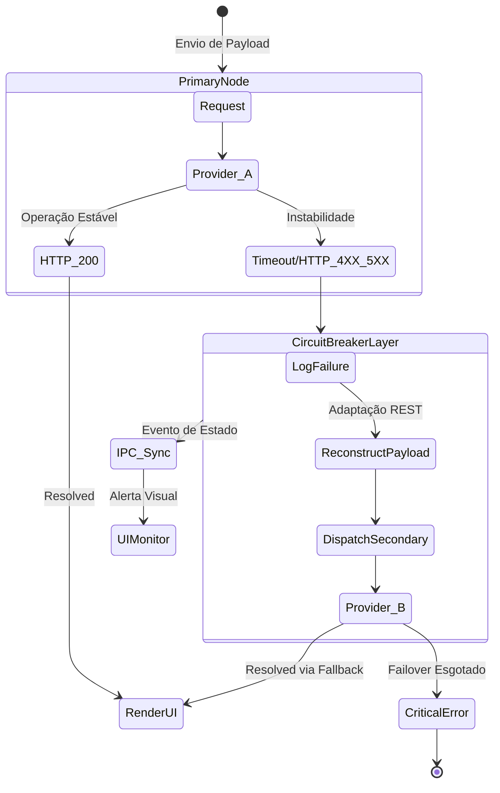

# Resiliência e Motor de Fallback (Circuit Breaker)

Operações baseadas em APIs de terceiros expõem a aplicação a riscos de disponibilidade e intermitência. Problemas de latência, manutenções em datacenters ou esgotamento de *Rate Limits* (HTTP 429) por parte de provedores em nuvem podem gerar paradas drásticas em aplicações SaaS.

O **ONE Architecture** endereça essas vulnerabilidades via implementação estrutural de um motor de Fallback gerido sob o padrão **Circuit Breaker** acoplado a uma interface agnóstica de comunicação.

## Camada de Tradução Agnóstica (Provider-Agnostic Layer)
Para viabilizar o chaveamento fluído, o ecossistema evita dependência estrita (tight coupling) a SDKs proprietários (como pacotes oficiais Node.js dos provedores). 

Todas as chamadas operam por meio de um orquestrador REST central. A lógica converte abstrações internas de Payload para as especificações JSON e de Autenticação requeridas pelo modelo-alvo em tempo real (OpenAI, Anthropic, Gemini, etc). Esta arquitetura isola o domínio de negócios da infraestrutura externa.

## Algoritmo de Repescagem (Failover Management)
O sistema detém uma matriz prioritária de instâncias configuráveis. Em caso de instabilidade, a recuperação ocorre em milissegundos sem degradação catastrófica.

1. **Processamento Primário:** A requisição é endereçada ao provedor definido no Tier 1 (ex: Anthropic Claude). O timer de latência é disparado.
2. **Captação de Exceção:** Respostas associadas a limites de taxa, interrupção de serviço (HTTP 5XX) ou estouro de tolerância temporal acionam a abertura do circuito. O evento é logado ativamente.
3. **Chaveamento e Retentativa:** O motor descarta a integração atual, substitui as credenciais e formata o Payload para a próxima contingência (ex: OpenAI GPT-4o), reiniciando o disparo na mesma *Promise chain*.
4. **Degradação Suave (Graceful Degradation):** Eventos não-críticos são comunicados de volta ao UI por IPC, sinalizando transparentemente o chaveamento para garantir *Feedback* operacional contínuo.

## Benefícios de Negócio
- **Alta Disponibilidade e SLA:** A dependência em provedor único é diluída. Eventos de *downtime* nos grandes players geram, na pior das hipóteses, adições incrementais em latência ao invés de paralisia do sistema.
- **Mitigação Financeira:** Modelos primários (geralmente custosos por deterem maior complexidade analítica) são resguardados por opções secundárias de alta performance/baixo custo, gerindo eventuais transbordos ou interrupções de fluxo com impacto orçamentário reduzido.
