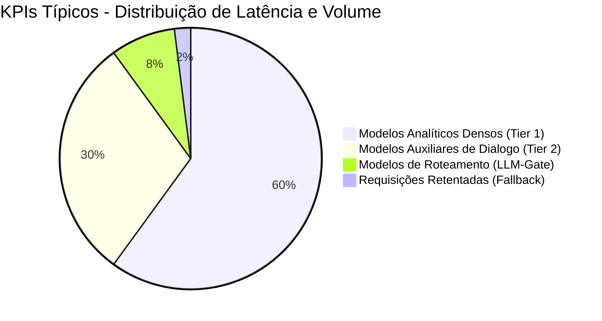

# Observabilidade e Telemetria (AI Analytics / LLMOps)

O dimensionamento corporativo de ferramentas de IA exige auditoria fina sobre estabilidade, eficiência e precificação das inferências. Em vez de acoplar soluções de monitoramento externas que acarretam latência e violação do fluxo local (*Privacy-by-Design*), o **ONE** opera um módulo nativo de **LLMOps e Telemetria**.

## Interceptação e Coleta (Middleware Pattern)
Todos os serviços comunicantes com LLMs transitam via um proxy de controle no Node.js. Ao finalizar um ciclo de resposta (sucesso ou falha), um observer consolida os metadados da transação via rotinas não bloqueantes, armazenando o log físico estruturado no ambiente local.

As variáveis monitoradas englobam:
- **Identificadores:** Provedor e especificação do Modelo processante.
- **Custos (Token Usage):** Contabilização de Input/Output.
- **SLAs (Latência):** Medição total em milissegundos.
- **Rastreabilidade (Contexto RAG):** Quais clusters documentais foram injetados na memória via *LLM-Gate* para a exata requisição.
- **Matriz de Resiliência:** Avaliação do emprego da Fila de Fallback e dos status de saída (Success, Error).

## Business Intelligence (Dashboard Frontend)
O *AI Analytics Dashboard* interpreta o cluster de logs, habilitando gestão tática sob os dados:

1. **Visão Holística:** Agrupamento de consumo, apontamento de anomalias operacionais (como picos imprevistos no consumo de Tokens).
2. **Qualidade de Serviço (QoS):** Taxa de falhas ativas fragmentadas por provedor, evidenciando quando instâncias devem ser deslocadas no Motor de Fallback.
3. **Auditoria Transacional (Debug):** Inspect unitário de instâncias. O sistema espelha o Payload bruto de Input, detalha a base injetada de RAG (Context Mapping) e projeta o Output final. Crucial para rastreamento de causa raiz (Root Cause Analysis) frente a respostas corrompidas.

## Valor Arquitetural e de Operação
Essa estrutura nativa elimina suposições (Guesswork). O ciclo de melhoria passa a ser embasado matematicamente. Desvios no uso de tokens, eficácia do *Prompt Engineering* e comportamentos anômalos de leitura (RAG) podem ser isolados e ajustados, viabilizando previsibilidade de custo (OpEx) sem transferir dados clínicos a servidores de *Monitoring* de terceiros.
