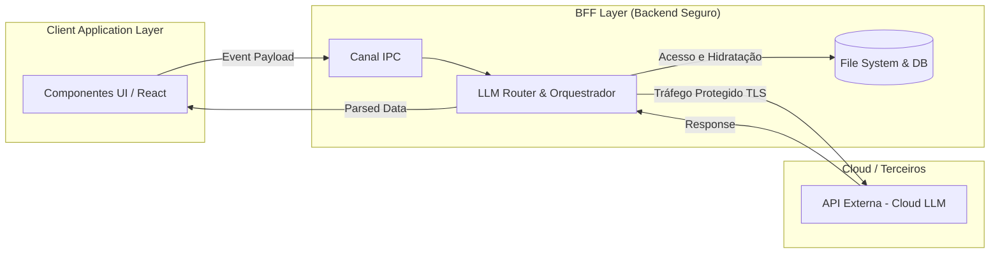

# Governança de Dados e Arquitetura Desacoplada (BFF)

Sistemas Corporativos integrados a Grandes Modelos de Linguagem (LLMs) atraem escrutínio profundo relacionado à governança da informação e proteção de dados. Provedores B2B exigem garantias estruturais contra vazamento e ingerência regulatória.

A infraestrutura do **ONE** gerencia essa fricção ao acoplar o modelo de *Zero-Trust Local Governance* ao padrão *Backend-For-Frontend* (BFF), viabilizando compliance estrito sem prejudicar flexibilidade de UI.

## 1. Zero-Trust Local Architecture (Privacy-by-Design)
Integrar a camada de dados com ecossistemas em nuvem diretamente via provedores de IA transfere o passivo operacional aos serviços externos.

A arquitetura segmenta a persistência, instituindo os seguintes critérios:
- O ecossistema transacional (banco JSON / Local Storage) reside na instância do usuário, sem vinculação a backends de Nuvem na fase atual, atendendo às exigências da LGPD de imediato.
- **Sanitização Stateless:** Provedores como Anthropic e OpenAI atuam meramente como processadores computacionais, consumindo um payload temporário focado no processamento local (Context Window) e encerrando o acesso ao finalizar o ciclo HTTP, assegurando total isenção do provedor quanto aos dados originais (Data Privacy).

## 2. Isolamento de Responsabilidades (BFF Pattern)
Engenharia ineficiente costuma concentrar integrações de API e lógica HTTP no cliente (*Frontend Components*), expondo chaves de segurança e superlotando a apresentação com manuseio analítico.

O **ONE** endereça esse erro estrutural executando o padrão BFF sob o IPC (Inter-Process Communication) do framework local (Electron Node.js):

### Separação (Separation of Concerns)
1. **Frontend Layer (React):** Opera exclusivamente na apresentação dos elementos e expedição de submissões sintéticas (Event-driven). O Frontend é totalmente abstinente no conhecimento de fluxos REST, Rate Limits, RAG ou orquestrações de Fallback.
2. **Backend/BFF Layer (Node.js):** Consumidor único das requisições IPC. Esse motor acessa os DBs restritos, carrega componentes em disco, aplica lógicas de roteamento, serializa headers HTTP e controla a conexão segura.
3. **Resolução de Evento:** Apenas strings textuais assépticas ou flags computacionais retornam à ponte IPC e atingem a Interface Gráfica.

### Sustentabilidade Arquitetural
Essa orquestração robusta facilita *Refactoring* em larga escala. Eventual transição do Desktop para Plataformas Nativas (Mobile/Web) demandaria modificação unicamente no motor de apresentação UI. O pipeline cognitivo (O BFF) preserva-se inalterado, solidificando a fundação corporativa do produto.
